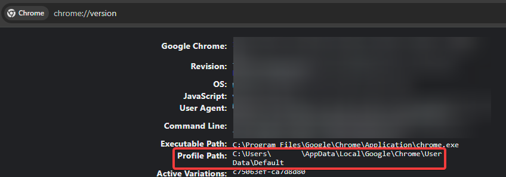

# Instructions
1. Download [Python](https://www.python.org/downloads/) and clone this repository or download as zip

2. Make a virtual environment and install helium
    1. `python -m venv venv`
    2. `.\venv\Scripts\Activate.ps1` or `. venv/bin/activate`
    3. `pip install helium`

3. Open Chrome, go to [chrome://version/](chrome://version/) and copy the **Profile Path** but leave out \Default

Ex. C:\Users\username\AppData\Local\Google\Chrome\UserData
4. Edit *config.py* and fill in with the profile path and your information with what you would enter into the Google Form

5. Run *attendence.py* with `python attendence.py`
    > Make sure you're logged in with your school Google account
